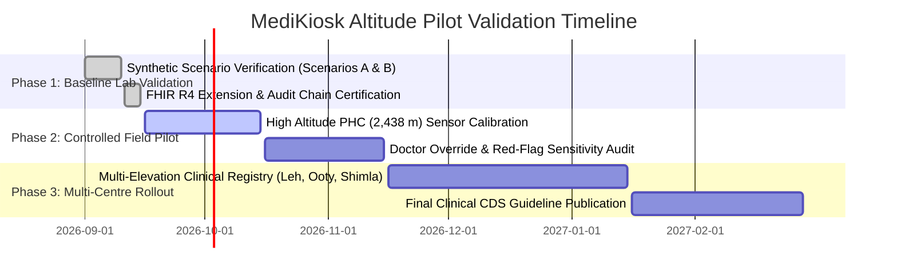

# MediKiosk Altitude-Aware Intake: Clinical Pilot Validation Framework & Metrics

> **Safety & Regulatory Disclaimer**:
> *“Decision-support MVP. Illustrative altitude profiles. Raw values preserved. Clinician sign-off required. Pilot validation needed.”*

---

## 1. Executive Summary & Purpose

This document defines the quantitative and qualitative clinical evaluation metrics for piloting MediKiosk’s Altitude-Aware Decision Support System at high-altitude clinical deployments (e.g., Primary Health Centres in Leh, Kargil, Shimla, and Tawang). 

The primary objective is to demonstrate that introducing **altitude context** into kiosk intake improves triage sensitivity and reduces false alarms without introducing diagnostic delays or data degradation.

---

## 2. Pilot Validation Metrics Matrix

| # | Metric Name | Target Benchmark | Measurement Methodology | Clinical Significance |
| :- | :--- | :--- | :--- | :--- |
| **1** | **SpO2 Accuracy vs Clinical Assessment** | $\ge 95\%$ concordance ($\pm 2\%$ SpO2) | Compare kiosk pulse oximeter readings and altitude-adjusted categorization against arterial blood gas (ABG) or physician reference pulse oximetry. | Prevents silent hypoxemia under-triage while avoiding misclassification of normal physiological altitude acclimation. |
| **2** | **BP Device Accuracy** | $\pm 5$ mmHg systolic/diastolic vs manual mercury sphygmomanometer | Triplicate paired readings taken within 5 minutes using validated oscillometric kiosk cuff against auscultatory mercury manometer by trained nurse. | Confirms standard blood pressure validity. Guarantees that normotensive ranges are never shifted upward for altitude. |
| **3** | **Red-Flag Sensitivity** | $\ge 99.0\%$ for emergent altitude pathologies (HAPE, HACE, severe hypoxemia) | Retrospective and prospective audit of all cases diagnosed with acute altitude emergencies by senior clinicians vs kiosk triage flag. | Zero tolerance for missed critical altitude emergencies (High Altitude Pulmonary/Cerebral Edema). |
| **4** | **False-Alert Rate** | $< 8.0\%$ among acclimatized populations at $\ge 2,500$ m | Proportion of yellow/red flags generated by kiosk that are classified as non-actionable or clinically normal upon physician evaluation. | Prevents clinical alert fatigue and preserves referral transport bandwidth in resource-constrained mountainous regions. |
| **5** | **Doctor Override Rate** | $5\% - 15\%$ steady state | Proportion of kiosk altitude interpretations that attending clinicians formally override via the HPR Doctor Command Center. | An override rate $>25\%$ indicates miscalibrated altitude profiles; a rate $<2\%$ may indicate uncritical physician reliance or lack of engagement. |
| **6** | **Time to Escalation (TTE)** | $\le 45$ seconds from vital acquisition to fast-track notification | Timestamp delta between kiosk sensor ingestion (`captured_at`) and WebSocket alert delivery (`ALTITUDE_RED_FLAG`) at Doctor Command Center. | Enables immediate oxygen therapy or hyperbaric bag deployment before irreversible decompensation occurs. |
| **7** | **Patient Comprehension** | $\ge 90\%$ patient comprehension score | Multi-lingual post-intake kiosk survey (Hindi, Ladakhi, English) evaluating patient understanding of vitals display and instructions. | Ensures health literacy across diverse rural, tribal, and pilgrim populations (e.g. Amarnath, Char Dham yatris). |

---

## 3. Metric-by-Metric Detailed Specifications

### Metric 1: SpO2 Accuracy vs Clinical Assessment
- **Formula**:
  $$\text{Concordance Rate} = \frac{\sum (\lvert \text{SpO2}_{\text{kiosk}} - \text{SpO2}_{\text{reference}} \rvert \le 2\%)}{N_{\text{total}}} \times 100\%$$
- **Protocol**: Evaluated across 5 altitude strata:
  1. Band 1: Sea level to 500 m
  2. Band 2: 500 m to 1,500 m
  3. Band 3: 1,500 m to 2,500 m
  4. Band 4: 2,500 m to 3,500 m
  5. Band 5: Extreme altitude (> 3,500 m)
- **Data Points Logged**: `vitals[type=spo2].value`, `vitals[type=spo2].altitudeContext.expectedRange`, reference pulse oximeter reading, skin temperature, perfusion index.

### Metric 2: Blood Pressure Device Accuracy
- **Formula**:
  $$\text{Mean Absolute Error (MAE)} = \frac{1}{N} \sum_{i=1}^N \lvert \text{BP}_{\text{kiosk}, i} - \text{BP}_{\text{reference}, i} \rvert \le 5\text{ mmHg}$$
- **Protocol**: ISO 81060-2 non-invasive sphygmomanometer standard.
- **Safety Invariant**: Strict clinical guardrail: Normal systolic ($<120$ mmHg) and diastolic ($<80$ mmHg) limits remain fixed. Hypertensive crisis threshold remains $\ge 180 / \ge 120$ mmHg regardless of station altitude.

### Metric 3: Red-Flag Sensitivity
- **Formula**:
  $$\text{Sensitivity} = \frac{\text{True Positives}}{\text{True Positives} + \text{False Negatives}} \times 100\%$$
- **Target Condition Set**:
  - Hypoxemia with danger symptoms (chest tightness, rest dyspnea, cyanosis, ataxia)
  - Severe hypoxemia ($>5\%$ below altitude expected minimum)
  - Suspected Acute Mountain Sickness (AMS) / Lake Louise Score $\ge 3$
  - Hypertensive crisis ($\ge 180 / \ge 120$ mmHg)

### Metric 4: False-Alert Rate
- **Formula**:
  $$\text{False Alert Rate} = \frac{\text{False Positives}}{\text{Total Triage Alerts (Red + Yellow)}} \times 100\%$$
- **Goal**: Minimize false hypoxemia alerts in healthy natives or well-acclimatized long-term residents whose baseline SpO2 naturally equilibrates between 90%–94% at 3,500 m.

### Metric 5: Doctor Override Rate
- **Formula**:
  $$\text{Override Rate} = \frac{\text{Total ALTITUDE\_INTERPRETATION\_OVERRIDDEN Events}}{\text{Total High Altitude Sessions Reviewed}} \times 100\%$$
- **Auditing**: Every override requires an HPR biometric token, specified override status (`normal`, `borderline`, `critical`), clinical reason, and produces a tamper-evident SHA-256 chained audit record in `models/AuditLog.js`.

### Metric 6: Time to Escalation (TTE)
- **Formula**:
  $$\text{TTE} = T_{\text{doctor\_notified}} - T_{\text{vitals\_captured}}$$
- **SLA**:
  - Tele-triage dashboard alert: $\le 3$ seconds (WebSocket push).
  - SMS / automated dispatch to on-call medical officer: $\le 45$ seconds.

### Metric 7: Patient Comprehension
- **Formula**:
  $$\text{Comprehension Index} = \frac{\text{Passed Comprehension Questions}}{\text{Total Comprehension Questions Evaluated}} \times 100\%$$
- **Key Assessment Items**:
  - Did the patient understand why their oxygen reading was compared against high-altitude expected levels?
  - Was the color coding (Green = Normal, Yellow = Borderline, Red = Action Required) clear?
  - Did the patient know what immediate action was required (e.g., sit down, notify desk, accept oxygen)?

---

## 4. Phase Pilot Rollout Plan

---

## 5. Clinical Safety & Legal Governance

1. **Software as a Medical Device (SaMD) Classification**: Under CDSCO / ISO 13485 guidelines, this MVP operates as a Class B Clinical Decision Support tool.
2. **Immutable Traceability**: Every vital reading, rule trigger, and doctor override is cryptographically linked with SHA-256 hash chains in `AuditLog`.
3. **Data Sovereignty**: Conforms to National Health Data Management Policy (NDHM / ABDM) with NRCeS India FHIR R4 schemas.
4. **Mandatory Disclaimer Displayed on All Screens**:
   > *“Decision-support MVP. Illustrative altitude profiles. Raw values preserved. Clinician sign-off required. Pilot validation needed.”*
